# 智能合同管理系统（Contract Management System）

基于 **Odoo 17 CE + FastAPI + Chroma** 的企业级合同智能处理平台。

> 版本：v1.2.0 · 最后更新：2026-09-11 · 进度：M1–M18 + P0 三项全部完成 · pytest 128 项全通过

## 这是什么

一句话：**合同 PDF 传进去，结构化业务数据出来**。

用户在 Odoo 上传一份合同 PDF，AI 服务自动完成「解析 → 分类 → 关键字段提取」，结果直接回填合同台账、自动生成收付款计划，并支持审批流、逾期提醒、到期归档——把人工录入一份合同半小时的活儿压缩到 1-2 分钟无人值守完成。

- **业务平台**（Odoo 17 自定义模块 `contract_ai`）：合同台账、5 态状态机、审批流、收付款台账、报表导出
- **AI 引擎**（FastAPI 微服务）：PDF 智能解析分流、RAG 增强字段提取、LangGraph 多 Agent 编排、双层校验兜底

## 🏗️ 架构概览

### ASCII 架构图（快速查看）

```
┌──────────────────────────────────────────────────────────────────────┐
│                       contract-net (Docker Bridge)                   │
│                                                                      │
│  ┌──────────────┐   HTTP JSON    ┌──────────────┐   gRPC/HTTP     │
│  │    Odoo 17   │◄──────────────►│  AI Service  │◄──────────────►│
│  │   (8069)     │                │    (8000)    │   (客户端 0.5.20) │
│  └──────┬───────┘                └──────────────┘                 │
│         │                                                           │
│         │  ORM (psycopg)                          ┌──────────────┐  │
│         ▼                                         │    Chroma    │  │
│  ┌──────────────┐                                 │   (8001)     │  │
│  │  PostgreSQL  │                                 │  向量存储    │  │
│  │   (5432)     │                                 └──────────────┘  │
│  └──────────────┘                                                   │
└──────────────────────────────────────────────────────────────────────┘
```

### Mermaid 架构图（Markdown 渲染器支持）

```mermaid
graph TB
    subgraph 用户层
        User([👤 用户])
    end

    subgraph "Docker · contract-net"
        Odoo[Odoo 17<br/>:8069<br/>合同管理业务模块]
        AI[AI Service<br/>FastAPI :8000<br/>PDF 解析 · 分类 · RAG 提取]
        Chroma[Chroma<br/>:8001<br/>向量存储<br/>contract_examples<br/>contract_chunks]
        Postgres[PostgreSQL<br/>:5432<br/>Odoo 关系库]
    end

    subgraph "外部服务"
        LLM[LLM API<br/>DeepSeek/OpenAI/通义]
        HF[HuggingFace<br/>BAAI/bge-small-zh-v1.5]
    end

    User -->|Web UI| Odoo
    Odoo -->|HTTP /api/contract/extract| AI
    AI -->|Chroma HttpClient| Chroma
    AI -->|Embedding Model| HF
    AI -->|LLM Chat| LLM
    Odoo -->|ORM| Postgres
```



| 服务 | 镜像 | 容器名 | 端口（宿主机） | 备注 |
|------|------|--------|---------------|------|
| `postgres` | `postgres:15-alpine` | contract-postgres | 5432 | Odoo 唯一关系库 |
| `chroma` | `ghcr.io/chroma-core/chroma:0.5.20` | contract-chroma | 8001 | ⚠️ 客户端必须严格对齐 0.5.20 |
| `ai-service` | 自定义 Python 3.11 | contract-ai | 8000 | FastAPI + PDF 解析 + RAG 提取 |
| `odoo` | `odoo:17.0` | contract-odoo | 8069 | 业务平台，自定义模块只读挂载 |

**⚠️ Chroma 版本关键约束**：服务端 0.5.20，客户端 chromadb 也必须 0.5.20。1.5.9 会因 `_type` 字段被旧版服务端拒绝。

## 🔄 业务数据流（一份合同的生命周期）

```
① 上传        用户在 Odoo 上传 PDF → 创建草稿合同 → 后台线程异步调 AI（页面立即跳转不阻塞）
② 解析分流    自动判定文字版/扫描版：文字版 pdfplumber 直抽 / 扫描件 OpenCV 去噪 + PaddleOCR
③ 文本清洗    去页码/页眉页脚/水印/OCR 噪声 + NUL(0x00) 字节清洗
④ 合同分类    关键词规则 + LLM 双通道，置信度融合（LLM 失败自动降级规则兜底）
⑤ 范例检索    按合同类型从 Chroma 检索 top-3 金标准范例（few-shot 注入提示词）
⑥ 字段提取    LLM(json_mode, temperature=0) 输出 15 个字段 JSON
⑦ 校验兜底    Pydantic（类型/枚举 Literal 硬约束）→ 业务校验（日期硬约束 + 大写金额互验）
              → 失败带错误信息重试 ≤3 次 → 正则补齐漏填字段（只补缺失、绝不覆盖）
⑧ 结果落库    字段自动回填合同台账 + chatter 通知；LLM 客户端首次调用时延迟初始化
⑨ 业财联动    付款条款正则解析 → 自动生成收付款计划 → 计划总额与合同金额平衡校验
⑩ 持续运营    双 cron：逾期计划按合同聚合提醒 + 到期合同自动归档；审批流 draft→approval→seal→archived
```

关键设计原则：
- **语义完整性**：切块按条款编号边界切（800 字符 + 50 重叠），保证检索到的每个 chunk 是完整语义单元
- **LLM 输出永不直接信**：四层校验闭环（JSON 容错解析 → Schema 校验 → 业务校验 → 正则兜底）
- **确定性优先**：能用规则解决的不上 LLM（分类兜底、付款条款解析、格式化字段补齐）

## 📂 项目结构

```
contract-system/
├── docker-compose.yml
├── .env.example
├── .gitignore
├── README.md                      ★ 本文档
├── PROJECT_CONTEXT.md             # AI 记忆文件（开发必读）
├── start.ps1                      # Windows 一键启动脚本
│
├── odoo/addons/contract_ai/       # ★ 唯一自定义模块
│   ├── models/                    # 8 模型
│   │   ├── contract.py            # 主台账：状态机 + AI 提取 + 汇总字段
│   │   ├── contract_config.py     # M17 系统配置单例（编号规则）
│   │   ├── contract_counterparty.py
│   │   ├── contract_signatory.py
│   │   ├── contract_template.py
│   │   ├── contract_element.py
│   │   └── contract_payment_plan.py  # M16 重写：状态机 draft→confirmed→paid
│   ├── views/                     # 8 视图 XML
│   │   ├── contract_views.xml
│   │   ├── contract_report_views.xml  # M17 台账 Pivot/Graph
│   │   ├── contract_config_views.xml  # M17 配置面板
│   │   ├── contract_payment_plan_views.xml  # M16 收付款台账
│   │   └── ...counterparty/signatory/template/menu
│   ├── report/                    # M17 PDF 报表
│   │   └── contract_pdf_reports.xml  # 台账汇总 + 合同详情 两套 QWeb
│   ├── controllers/               # M17 HTTP 控制器
│   │   └── contract_export.py     # openpyxl Excel 导出
│   ├── security/                  # 23 条 ACL
│   ├── data/                      # 合同编号序列
│   └── __manifest__.py
│
└── ai-service/
    ├── Dockerfile
    ├── requirements.txt           # chromadb==0.5.20 / openpyxl / requests
    │
    ├── app/
    │   ├── config.py              # pydantic-settings（.env 驱动）
    │   ├── main.py                # FastAPI + lifespan + 6 路由
    │   └── services/
    │       ├── pdf_parser.py      # M6: PDF 分流（pdfplumber / PaddleOCR）
    │       ├── chunker.py         # M7: 清洗 + 语义切块（纯标准库）
    │       ├── vector_store.py    # M8: Chroma HttpClient 双集合
    │       ├── prompt_manager.py  # M9: YAML 提示词 + 字段字典 JSON
    │       ├── llm_client.py      # M10: BaseLLM + 重试 3 次指数退避
    │       ├── classifier.py      # M11: 规则 + LLM 双通道 + 加权融合
    │       ├── rag_learner.py     # M12: few-shot 检索 + 格式化
    │       └── extractor.py       # M13: RAG 提取 + JSON Schema + 4 层重试
    │
    ├── prompts/
    │   ├── field_dict.json        # 9 组枚举字段字典
    │   └── v1~v3/prompts.yaml     # 版本化提示词
    │
    ├── examples/annotations/      # 12 份金标准合同标注
    │
    ├── tests/                     ★ M18 pytest 单元测试
    │   ├── conftest.py            # fixtures + 示例合同文本
    │   ├── test_chunker.py        # 40+ 测试（清洗/切块/clause 检测）
    │   ├── test_classifier.py     # 15+ 测试（规则/融合/边界）
    │   └── test_field_validator.py # 20+ 测试（日期/金额/模糊匹配/枚举）
    │
    ├── scripts/
    │   ├── bootstrap_examples.py  # 金标准入库
    │   ├── evaluate_m15.py        # M15 评估：RAGAS 4 指标 + Markdown 报告
    │   ├── run_accuracy_test.py   ★ M18 简化版准确率测试脚本
    │   ├── demo_script.py         ★ M18 演示步骤辅助脚本
    │   └── generate_annotation.py
    │
    ├── reports/                   # evaluate_m15.py 产出的 Markdown + JSON
    │
    └── test_m10~m14.py            # 各模块独立 mock 测试脚本
```

## 🚀 快速开始

### 前置条件

| 工具 | 版本要求 |
|------|----------|
| Docker Desktop | ≥ 4.20 |
| Docker Compose | ≥ 2.20 |
| 系统内存 | ≥ 6 GB（Chroma + Embedding 模型加载需要） |

### 一键启动

```bash
cd contract-system

# 1. 首次：复制环境变量模板
copy .env.example .env
#    ⚠️ 必须填 LLM_API_KEY，否则 AI 服务无法初始化

# 2. 构建并启动
docker compose up -d --build

# 3. 查看服务状态
docker compose ps
#    等四个全 healthy 再继续

# 4. 浏览器访问
#    Odoo:      http://localhost:8069
#    AI 服务:   http://localhost:8000/docs    (Swagger UI)
#    健康检查:  http://localhost:8000/api/health
```

### 常用运维命令

```bash
# ── Docker Compose ──
docker compose up -d                  # 后台启动（幂等）
docker compose down                   # 停止（保留数据卷）
docker compose down -v                # ⚠️ 完全重置（清空所有卷）
docker compose logs -f odoo           # 实时日志
docker compose logs -f ai-service

# ── Odoo 模块 ──
docker exec contract-odoo odoo -d contract_db -u contract_ai --stop-after-init  # 升级
docker exec contract-odoo odoo shell -d contract_db                              # ORM Shell

# ── openpyxl（Excel 导出）──
docker exec contract-odoo pip install openpyxl   # 临时安装
# 建议后续加到 Dockerfile: RUN pip install openpyxl

# ── AI 服务脚本 ──
docker exec contract-ai python scripts/bootstrap_examples.py    # 金标准入库
docker exec contract-ai python scripts/run_accuracy_test.py --offline
docker exec contract-ai python scripts/evaluate_m15.py --offline

# ── pytest 单元测试（本地，不需要 Docker）──
cd ai-service
pytest tests/ -v                      # 全部
pytest tests/test_chunker.py -v       # 只测切块
pytest tests/ -k "test_clean"         # 关键字过滤
```

## ⚙️ 配置说明

### `.env` 关键变量

```ini
# ── LLM（必填）──
LLM_PROVIDER=deepseek
LLM_API_KEY=sk-xxx
LLM_BASE_URL=https://api.deepseek.com/v1
LLM_MODEL=deepseek-chat

# ── Embedding（本地加载，免外网）──
EMBEDDING_MODEL=BAAI/bge-small-zh-v1.5
EMBEDDING_DIMENSION=512

# ── Chroma ──
CHROMA_HOST=chroma
CHROMA_PORT=8000

# ── HF 缓存 ──
HF_CACHE_HOST=C:/Users/<你>/.cache/huggingface/hub
```

### LLM Provider 切换

全部走 OpenAI 兼容协议，改三个变量即可：

| Provider | `LLM_PROVIDER` | 推荐模型 |
|----------|----------------|----------|
| DeepSeek | `deepseek` | `deepseek-chat` |
| 通义千问 | `qwen` | `qwen-plus` |
| OpenAI | `openai` | `gpt-4o-mini` |

## 🔌 AI 服务 API

| 方法 | 路径 | 说明 |
|------|------|------|
| GET | `/api/health` | 健康检查 |
| POST | `/api/contract/parse` | PDF 自动分流解析 |
| POST | `/api/contract/classify` | 合同分类（规则 + LLM 融合） |
| POST | `/api/contract/extract` | 字段提取（RAG few-shot） |
| POST | `/api/contract/extract-graph` | LangGraph 多 Agent 工作流提取（校验→重试回路） |
| POST | `/api/contract/extract-chain` | LangChain 线性管道提取（对照实现） |
| GET | `/api/vector/search` | 向量检索（调试用） |
| GET | `/api/vector/stats` | 向量库统计 |

Swagger UI：`http://localhost:8000/docs`

### curl 示例

```bash
# 健康检查
curl http://localhost:8000/api/health

# 文本分类
curl -X POST http://localhost:8000/api/contract/classify \
  -H "Content-Type: application/json" \
  -d '{"contract_text": "本合同为采购合同..."}'

# 字段提取（RAG）
curl -X POST http://localhost:8000/api/contract/extract \
  -F "file=@contract.pdf" \
  -F "use_rag=true"
```

## 📊 准确率数据（M15 离线测试）

使用 `python scripts/evaluate_m15.py --offline --no-ragas` 对 12 份金标准合同测试：

| 指标 | RAG OFF | RAG ON | 提升 |
|------|---------|--------|------|
| **字段准确率** | 88.89% | **98.61%** | +9.7 pp |
| Faithfulness | 0.889 | 0.986 | +9.7 pp |
| Answer Relevancy | 0.889 | 0.986 | +9.7 pp |
| Context Precision | 0.359 | 0.367 | +0.8 pp |
| Context Recall | 0.889 | 0.986 | +9.7 pp |

> 完整 Markdown 报告见 `ai-service/reports/m15_evaluation_*.md`

真实 LLM（DeepSeek）评估：字段准确率 **86.25% → 98.75%（+12.5 pp）**，4 项 RAGAS 指标同步提升（见 `reports/m15_evaluation_20260904_155526.md`）。

## 🔍 PDF OCR 场景选型（考核 E）

**核心思想：不是无脑 OCR，按 PDF 类型工程化分流。**

| 场景 | 管线选型 | 实现 |
|------|---------|------|
| 文字版 PDF（有文本层） | pdfplumber 直接抽取，**不做 OCR** | `PdfProcessor._text_pipeline` |
| 扫描件/图片型 PDF | PyMuPDF 渲染 300dpi → OpenCV 预处理 → PaddleOCR | `PdfProcessor._ocr_pipeline` |
| 复杂表格/歪斜/脏污 | Hough 直线检测自动纠偏（`_deskew`）+ 自适应二值化去噪（`_preprocess_image`）+ PP-Structure/PPStructureV3 表格识别 | 表格输出 HTML + 二维数组 |
| 分流判定 | pypdf/pdfplumber 检测文本层字符数：<50 判扫描件，50-100 判混合 | `PdfProcessor.detect_type` |

文字版 vs 扫描版同源对比实验（`scripts/test_ocr_comparison.py`，合成扫描件 200dpi）：
文字版相似度 **100%** / 耗时 0.1s；扫描版走 OCR 管线可恢复关键字段，但字符级损耗与耗时显著更高 →
**证明"文字版直抽、扫描件才 OCR"的选型是工程决策而非人肉**。完整报告见 `ai-service/reports/ocr_comparison_*.md`。

## 🧠 原理讲解（考核 F：结合本项目讲透 Transformer 与向量库）

### 1. 文本如何变成向量

Tokenization 把条款文本切成 token 序列 → Transformer Encoder 逐层 self-attention 编码上下文 → 取 [CLS]/均值池化得到定长向量。
本项目用 `BAAI/bge-small-zh-v1.5`（512 维）：一条付款条款进 Embedding 模型后变成 512 个浮点数，**维度里存的是"语义坐标"**——
"合同签订后支付 30% 预付款"和"签约后 5 日内付三成"字面不同，但语义坐标距离很近，这就是向量检索能跨措辞匹配的原因。

### 2. Attention 一句话直觉 + 余弦相似度

Attention = **每个 token 用 Q（我在找什么）与所有 token 的 K（我有什么）做点积打分，再加权求和 V（实际内容）**——让"金额"这个词的表示吸收上下文中"伍拾万元整"的信息。
余弦相似度度量两个向量夹角：本项目里"采购合同"与"购销协议"语义坐标夹角小（相似度 ≈0.9+），与"员工手册"近乎正交（≈0.2）——
分类模块（M11）的关键词规则给出可解释基线，LLM 语义分类给出泛化判断，两者融合正是"符号 + 向量"双通道。

### 3. 全链路白板推演（对应本项目数据流）

```
PDF 上传 → PdfProcessor 分流（文字版直抽 / 扫描件 OCR）
        → chunker 按条款语义切块（非无脑 500 字硬切，保留"第X条"结构标签）
        → bge Embedding 512 维向量化
        → Chroma 入库（HNSW 近似最近邻索引，O(logN) 检索）
新合同 → 向量化 → 相似检索 top_k=3 金标准范例
        → 范例（输入文本+标准提取结果）作为 few-shot 回填 Prompt
        → LLM 结构化提取（JSON Schema 约束）→ Pydantic 校验 → 正则兜底
        → Odoo 入库 → 付款计划自动生成（业财一体化）
```

M15 对比实验证明此链路有效：离线对比 few-shot 使字段准确率 86.25% → 98.75%（+12.5pp）；真实 LLM（DeepSeek）盲测 20 份金标准达 99.58%。

## 🧪 测试

### pytest 单元测试（本地跑）

```bash
cd ai-service
pip install pytest

# 全部
pytest tests/ -v
#     test_chunker.py  40+ 测试
#     test_classifier.py  15+ 测试
#     test_field_validator.py  20+ 测试

# 覆盖率报告（需要 pytest-cov）
pip install pytest-cov
pytest tests/ --cov=app --cov-report=term-missing
```

### 准确率测试脚本

```bash
cd ai-service

# 离线 mock（不调 LLM，快速出报告）
python scripts/run_accuracy_test.py --offline

# 真实 API 调用（需 Docker + LLM Key）
python scripts/run_accuracy_test.py --annot-dir examples/annotations

# 自定义 AI 服务地址
python scripts/run_accuracy_test.py --ai-url http://localhost:8000
```

### evaluate_m15.py（完整版评估）

```bash
# 离线模式（用 mock 预测值演示输出）
python scripts/evaluate_m15.py --offline --no-ragas

# 真实 RAGAS 评估（需要 ragas 库 + 真实 LLM）
python scripts/evaluate_m15.py

# 自定义输出目录
python scripts/evaluate_m15.py --output-dir reports
```

## 📤 导出功能（M17）

### Excel 导出（openpyxl）

在 Odoo 合同列表页点击 header 「📤 导出 Excel」按钮，或通过 HTTP：

```
GET /contract/export/excel?type=purchase&state=seal&date_from=2026-01-01&date_to=2026-12-31
```

导出内容：
- **Sheet 1 · 合同列表**：17 列（编号/名称/类型/状态/甲乙方/日期/金额/计划/已完成/剩余...），金额带 `¥#,##0.00` 格式 + 边框样式
- **Sheet 2 · 汇总分析**：按合同类型分组，统计合同数/总额/已完成/已完成占比

> ⚠️ openpyxl 需额外安装：`docker exec contract-odoo pip install openpyxl`

### PDF 导出（Odoo QWeb + wkhtmltopdf）

Odoo 原生机制——选中合同 → 顶部「打印」按钮：

| 报表 | 适用场景 | 内容 |
|------|----------|------|
| **合同台账汇总 PDF** | 选中多条合同 | 汇总指标（总数/总额/已完成）+ 10 列表格 + 页脚时间 |
| **合同详情 PDF** | 单份合同 | 基本信息 + 甲乙双方 + 收付款计划表 + 付款方式条款 |

wkhtmltopdf 版本：0.12.6.1（已预装在 `odoo:17.0` 镜像中）

## 💰 业财一体化（M16）

### 自动生成收付款计划

在 Odoo 合同表单点击「📋 自动生成计划」按钮，系统会：

1. 正则解析 `payment_terms` 中文文本（按 [；;\n] 切句）
2. 提取百分比（30% / 百分之30 / 30 ％）
3. 匹配节点类型关键词（预付/到货/验收/尾款）
4. 估算时间偏移（显式天数优先 → 按 milestone 默认）
5. 自动生成 `contract.payment.plan` 记录（状态 draft）

**典型解析示例**：
```
输入: "合同签订后 5 个工作日内支付 30% 预付款；
       到货验收后 10 个工作日内支付 60%；
       剩余 10% 质保金届满后 30 日内支付"

输出: 3 个计划节点
  ① 预付款    → 30% × 合同额, 签订日 + 0 天
  ② 到货款    → 60% × 合同额, 签订日 + 30 天
  ③ 尾款      → 10% × 合同额, 签订日 + 90 天
```

### 收付款计划状态机

```
draft → confirmed → partial → paid
                   ↓
                cancelled
```

### 台账汇总（Odoo Pivot 视图）

合同管理 → 收付款台账 → 切换 Pivot 视图：
- 行维度：合同类型 × 收/付方向 × 状态
- 度量：计划金额 / 实际金额 / 剩余金额

## 🔢 编号规则配置（M17）

Odoo → 合同管理 → 系统配置：

| 参数 | 说明 | 示例 |
|------|------|------|
| 编号前缀 | 合同编号开头 | `HT-` |
| 日期格式 | 嵌入位置 | `YYYYMM` |
| 流水号补零 | 末尾位数 | `4` → 0001 |
| 起始流水号 | 首次启用 | `1` |

**编号生成流程**：
1. 新建合同时 `create()` 触发
2. `contract.config` 单例生成编号
3. 自动同步到 Odoo `ir.sequence`
4. 原子安全的 `next_by_id()` 获取流水号
5. 最终：`HT-2026090001`

## 🎬 演示脚本（M18）

```bash
cd ai-service

# 打印演示步骤（不执行）
python scripts/demo_script.py

# 逐步执行（只执行带命令的步骤）
python scripts/demo_script.py --run

# 慢速模式（每步 3 秒，方便录屏）
python scripts/demo_script.py --run --slow
```

## 🧠 LLM 客户端（M10）

```python
from app.services.llm_client import create_llm

llm = create_llm("deepseek", api_key="sk-xxx", model="deepseek-chat")

# JSON 模式（自动重试 + 格式验证）
resp = llm.chat(messages=[{"role": "user", "content": "..."}], json_mode=True)
print(resp.content)   # str, 已校验是合法 JSON

# 兼容 LangChain
resp = llm.invoke("判断合同类型：...")
```

- 重试 3 次指数退避（1s → 2s → 4s）
- json_mode 强制 `response_format={"type":"json_object"}` + `json.loads()` 二次验证
- 用 raw `openai.OpenAI` SDK，不是 LangChain ChatOpenAI

## 🧠 提示词管理（M9）

提示词统一在 `prompts/v1/prompts.yaml` 管理：

```yaml
# 4 个结构化条目：system_extract / classify / extract / extract_retry
# 变量替换：{contract_text} {few_shot_examples} {field_dict.dispute_resolution.values}
# 缺失变量保留原样不抛异常
# extract / extract_retry 自动继承 system_extract 的 system_prompt
```

版本切换：`PromptManager.rollback("v2")`

## 📦 数据持久化

| Docker Volume | 用途 |
|---------------|------|
| `odoo_db_data` | PostgreSQL 数据文件 |
| `odoo_data` | Odoo 附件、会话、缓存 |
| `chroma_data` | Chroma 向量库 |
| `odoo_logs` | Odoo 运行日志 |

⚠️ `docker compose down -v` 会清空全部卷（= 系统重置）

## 🔧 技术栈

| 层级 | 技术 | 版本 |
|------|------|------|
| 业务平台 | Odoo CE | 17.0 |
| 后端 | FastAPI / Uvicorn | Python 3.11 |
| LLM SDK | openai | 3.5.0（raw SDK） |
| 向量库 | Chroma | 0.5.20 |
| Embedding | BAAI/bge-small-zh-v1.5 | 512d |
| OCR | PaddleOCR / PaddlePaddle | latest |
| 关系库 | PostgreSQL | 15-alpine |
| PDF 导出 | wkhtmltopdf | 0.12.6.1 |
| Excel 导出 | openpyxl | 3.1.5 |

## 🏗️ 模块完成度

| 模块 | 内容 | 状态 |
|------|------|------|
| M1–M5 | Odoo 基础模型 + 视图 + 安全 | ✅ |
| M6 | PDF 分流解析 | ✅ |
| M7 | 文本清洗 + 语义切块 | ✅ |
| M8 | Chroma 向量存储 | ✅ |
| M9 | 提示词 YAML 管理 | ✅ |
| M10 | LLM 封装 + 重试 | ✅ |
| M11 | 规则 + LLM 分类 + 融合 | ✅ |
| M12 | RAG Learner（few-shot 检索） | ✅ |
| M13 | RAG 字段提取 | ✅ |
| M14 | FastAPI API 层（6 路由） | ✅ |
| M15 | 评估与报告（RAGAS 4 指标 + Markdown） | ✅ |
| M16 | 业财一体化（付款条款→收付款计划→台账） | ✅ |
| M17 | 配置域 + 台账报表 + Excel/PDF 导出 | ✅ |
| M18 | pytest 测试 + 准确率脚本 + README + 演示 | ✅ |
| **P0-1** | LangGraph 多 Agent 工作流（D3/D5 认证项） | ✅ |
| **P0-2** | Odoo 17 审批流（ir.actions.server + 审批日志）+ 双 Cron（B3/B5） | ✅ |
| **P0-3** | LLM 提取正则兜底（A 层次③，60% 结构化字段可靠补齐） | ✅ |

## 🔁 LangGraph 多 Agent 工作流（P0-1）

线性流水线用 LangChain Runnable 串行管道即可（`/api/contract/extract-chain`）；
**有状态、有回路的审查场景用 LangGraph StateGraph**（`/api/contract/extract-graph`）：

```
classify ──► extract ──► validate ──┬─(通过)──► review ──► END
   ▲                                │
   └──────── retry (≤2 次) ◄────────┘
```

- `ContractState` TypedDict 管理状态（text / contract_type / examples / retry_count / final）
- `conditional_edges` 路由：校验不通过 → retry 节点 → 重新提取（外层重试与 extractor 内层 JSON 重试互补）
- 证据点：`ai-service/app/graph/contract_graph.py` + `tests/test_contract_graph.py`

## ✅ 审批流 + 定时任务（P0-2）

**⚠️ Odoo 17 已删除 `workflow`/`workflow.activity`/`workflow.transition`**，
审批流用 **ir.actions.server + contract.approval.log 模型** 实现：

| 能力 | 实现 |
|------|------|
| 状态机 | draft →(提交) approval →(通过) seal →(归档) archived；approval 可驳回回 draft |
| 表单按钮 | 提交审批 / 审批通过 / 审批驳回（`contract_views.xml` header） |
| 服务端动作 | `security/contract_workflow_actions.xml` 3 个 ir.actions.server（表单"动作"菜单） |
| 审批日志 | `contract.approval.log`（合同 / 审批人 / 动作 submit·approve·reject·cancel / 意见），表单"✅ 审批记录"Tab 只读展示 |
| Cron ① | 每日扫描逾期收付款计划 → 按合同聚合 chatter 提醒（`_cron_overdue_reminder`） |
| Cron ② | 每日扫描已用印且失效日期已过的合同 → 自动归档（`_cron_expire_contracts`） |

审批全流程经 Odoo shell 冒烟验证：submit → reject → submit → approve 四条日志按序落库，到期合同被 cron 自动归档。

## 🩹 LLM 提取正则兜底（P0-3）

LLM 擅长语义但输出不稳定；对**结构化强格式字段**在提取后做正则补齐
（`app/services/postprocess_fallback.py`，铁律：只补缺失，绝不覆盖 LLM 已提取值）：

| 字段 | 策略 |
|------|------|
| contract_code | 标签锚定（"合同编号："）优先，无标签抓大写前缀编号 |
| amount | 总金额/总价锚定模式优先于泛化"人民币"模式，防"单价误当总额"；支持 万元/元/千分位 |
| 日期三兄弟 | 锚点上下文 80 字符内检索；阿拉伯/中文数字/空格变体归一化 YYYY-MM-DD；非法日期拒绝 |
| partner_a/b | 容忍括号角色（"甲方（买方）：XX 有限公司"），公司后缀词库收敛 |
| dispute_resolution | 关键词 → field_dict.json 合法枚举值 |
| currency | 币种符号/关键词 → ISO 代码 |

覆盖 15 字段中的 ~60%，兜底后接近 100% 可靠（评分标准 A 层次③证据）。

## 🛡️ NUL 字节防御（2026-09-11）

真实合同提取曾报 `A string literal cannot contain NUL (0x00) characters`。
根因：PDF 文本层混入 `\x00`（嵌入字体 ToUnicode 映射缺失时 pdfplumber 会抽出 NUL 字节），
Python/JSON 层全程合法（JSON 转义 `\u0000`），直到 psycopg2 写 PostgreSQL 才报错——
**TEXT 与 JSONB 类型均拒绝含 NUL 的字符串**。双层修复：

| 层 | 位置 | 做法 |
|----|------|------|
| 源头 | `ai-service/app/services/pdf_parser.py` → `extract_text` 主入口 | 清洗 `text` + 每页 `pages`，warning 日志记录清洗数 |
| 写入侧 | `odoo/.../models/contract.py` → `_strip_nul` | 递归清洗整棵 AI 返回树（dict/list/str），覆盖 TEXT 字段与 `ai_extracted_json`（JSONB） |

经验：跨语言数据边界（PDF → Python → JSON → PostgreSQL）每一层的合法性规则不同，
清洗要么做在数据入口，要么做在存储出口，最好两层都有。

## 🤝 开发约定

1. **不修改 Odoo 源码**——所有业务逻辑写在 `odoo/addons/contract_ai/`
2. **容器间只通过服务名互访**——禁止写 `localhost` 或 IP
3. **配置即代码**——`.env` → `docker-compose.yml` → 环境变量，不硬编码
4. **XML ID 前缀**——`contract_ai.xxx`
5. **模块命名**——唯一自定义模块 `contract_ai`

## 📝 License

内部项目，仅供团队使用。
